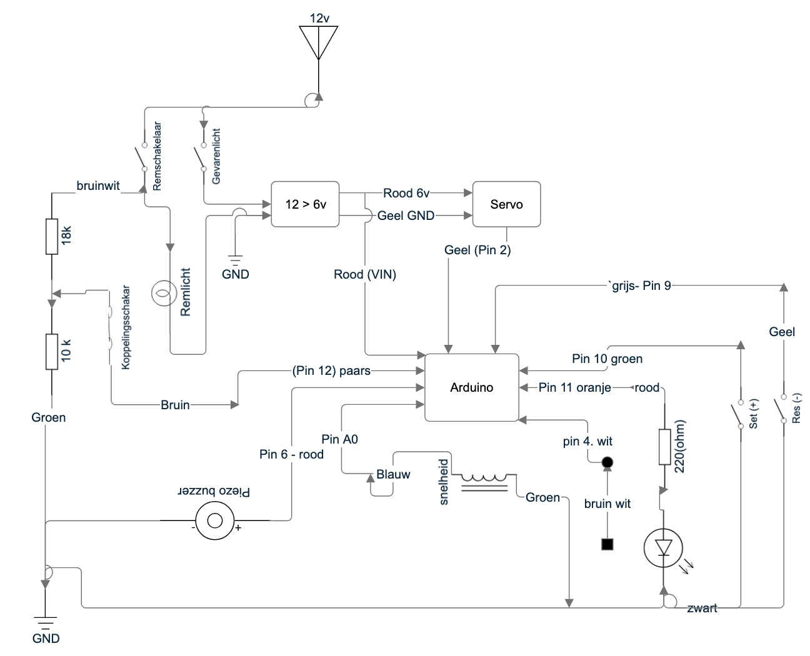

# Cruise controll
Maak op basis van standaard onderdelen een cruise controll

3D render van de cruisecontrol

### Werking
Op het dashboard zit een knop. Deze schakeld de stroom aan/uit naar de cruiscontroll. Bij uitschakelen trekt de gasveer (die die brandstof toevoer regelt) altijd hard genoeg om het gas 'los te laten'.

Na inschakelen van de spanning, druk je tegelijkertijd een seconde op de twee knopjes. Dan staat de CruiseControll aan. Als je nu de Plus knop twee seconden vasthoud is de CC actief en gaat deze de gemeten snelheid die opgeslagen is bij indrukken van de Plusknop, proberen te behouden door de servo verder uit te draaien. 

Ik meet de sneheid met een pickup spoel die dicht bij de draaiende magneet op de cardan as zit.

Als je de rem of koppeling indruk zal zal de waarde op de betreffende pin van GND naar Hoog gaan (door de interne pullup weerstand van de arduino)

Aansluitschema

Gebruikte stekker

### Benodigdheden

* Arduino Micro (Micro Pro kan ook)
* 40k/cm 9imod Borstelloze Servo
* Spanningsregelaar 3A - 14V -> 6V 12V naar 6V Converter Auto Power Buck Converter Spanningsregelaar 3A 18 W 
* versnellingskabel fiets (bij je fietsenmaker)
* gastonnetje, https://www.bromfietsshop.nl/nippel-schroef-6x14mm-html.html
* 
* Pick-up spoel (hall sensor is volgens mij beter) https://nl.aliexpress.com/item/1005009333531538.html

* Twee knopjes op je richtingaanwijzer/dashboard met LEDJE

